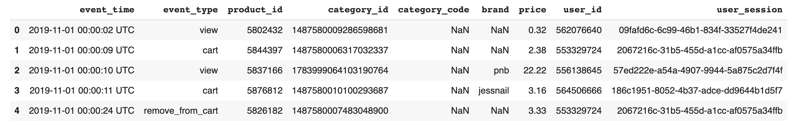
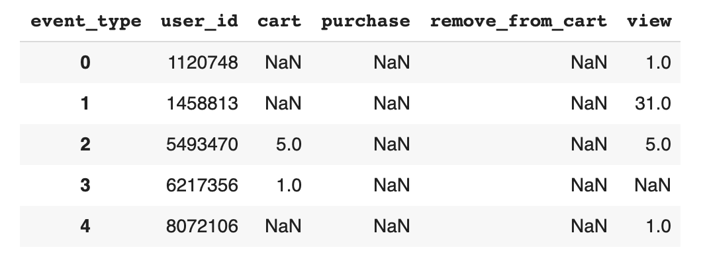
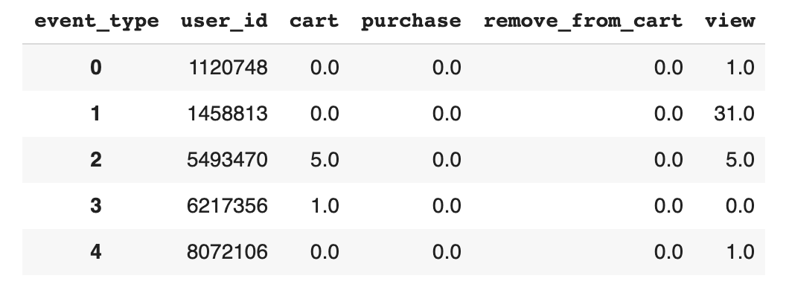
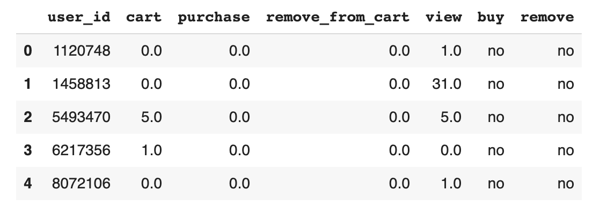
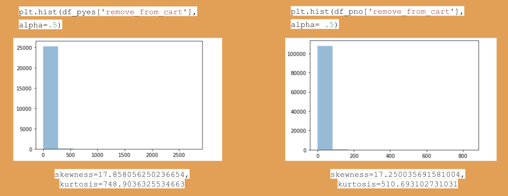
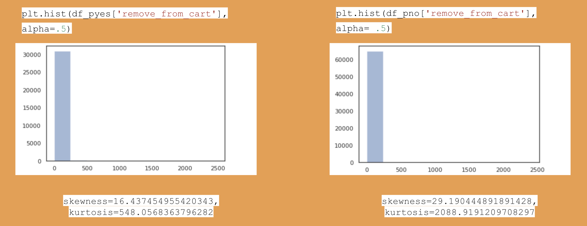
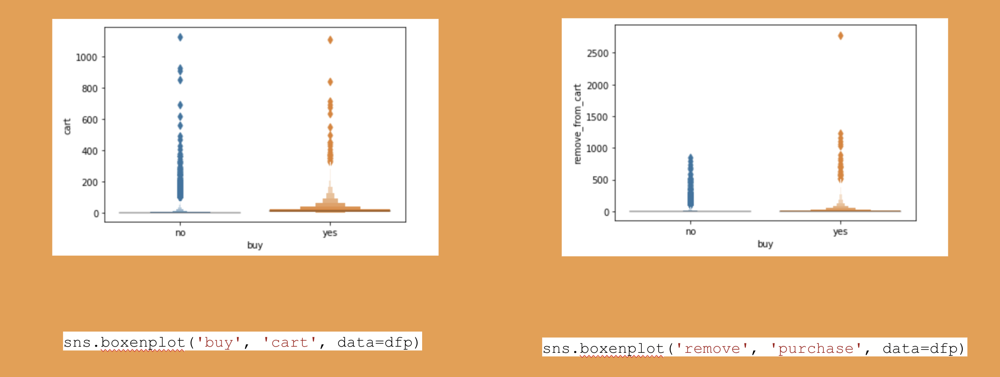
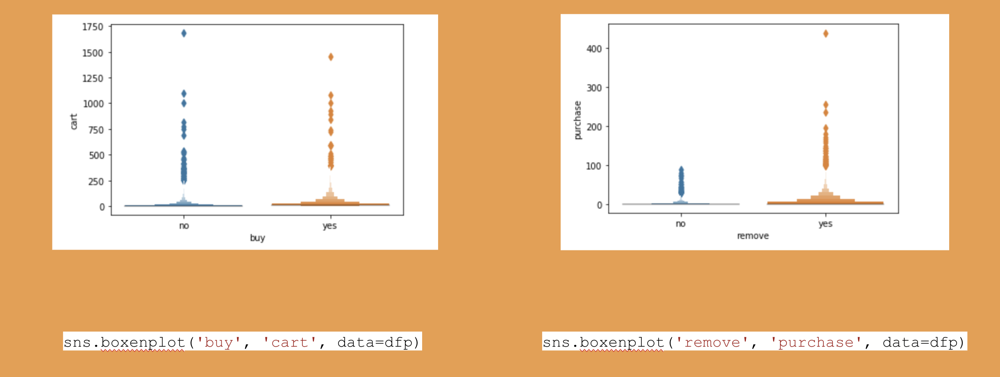

# eCommerce A/B Testing Project

Run an A/B test to determine if there is a significant difference in purchases between shoppers who remove items from their cart and shoppers who do not remove items from their cart.

As the online shopping community continues to grow it becomes increasingly important for marketers to understand consumer behavior in the online environment. This study aims to shed light on such behavior for an eCommerce cosmetics shop so marketers can effectively incentivize shoppers to follow through with making purchases. 

 
</img>

# DATA:

Events history for a eCommerce cosmetics shop
- November and October 2019
- 9 variables
- Over 4 million rows
- from Kaggle (https://www.kaggle.com/mkechinov/ecommerce-events-history-in-cosmetics-shop)

</img>

# Theory:
There are two ways people reach decisions, with or without a significant amount of thought. Generally speaking, the more consequences a decision-maker perceives a decsion to have, the more they'll think about what decision to make. Unlike when shoppers have carts at the grociery store, adding items to online shopping carts never nesscitiates shoppers remove items they no longer wish to purchase, or reach the checkout line at all. In other words, relative to people shopping in a store, online shoppers are not as detered from adding products to their carts they have no intention to purchase, because doing so is a virtually inconsequential decision. With that in mind, how can online retial stores gage when online shoppers do intend to purchase what they add to cart? 

I theorize one action that may signal a shopper is more seriously considering making a purchase is removing an item from their cart. By removing items shoppers indicate they are crtically assesing what they have in their cart, and again people generally think more about decisions that have consequences. Making a purchase is a consequential descision so my hypotheses are as follows.. 

# Hypothesis:

Ho: Adding products to a cart and removing products from a cart equally indicate a purchase.

Ha: Removing products from a cart better indicates a purchase than adding products to a cart.

# DATA ANALYSIS:

# 1. Data Preparation:
In this step I prepare the data for analysis.

# 2. Exploratory Analysis:
In this step I explore the shape of the data. 

# 3. A/B Test:
In this step I conduct an A/B test to evaluate the hypotheses. 

------------------------------------------------------------------------------------------------------------------------------

# Data Preparation 

**Step 1 : Pivot df**

- Drop columns insignificant for A/B testing
- Set all "price" values > 0 equal to 1 
- Pivot table on "event_type", with "user_id" as the index, and the sum of "price" as the values

</img>

**Step 2 : Clean df**

- Fill NaNs with 0
- Reset index

</img> 

**Step 3 : Feature Engineering**

- Add a column called "buy" and set values equal to "yes" if "purchase" is > 0, and "no" if "purchase" is = 0
- Add a column called "remove" and set values equal to "yes" if "remove_from_cart" is > 0, and "no" if "remove_from_cart" is = 0
 
 </img>
 
# Exploratory Analysis

**Step 1 : Split the data**
- split data into two groups
  * df_pyes : purchase = yes
  * df_pno : purchase = no

**Step 2 : Check October Distributions**
- Visually and statistically exmaine the distribution of "remove_from_cart" for October

</img>

### Conclusion: Do not visually appear to be normally distributed
### Conclusion: Are not statistically normally distributed

**Step 3 : Check November Distributions**
- Visually and statistically exmaine the distribution of "remove_from_cart" for November

</img>

### Conclusion: Do not visually appear to be normally distributed
### Conclusion: Are not statistically normally distributed

# A/B Test
- Data does not follow a Gaussian distribution -> run Kurskal-Wallace test
- stats.kruskal(df_pyes['remove_from_cart'],df_pno['remove_from_cart'])
  * October
  * November

# A/B Test Results :
- Statistically different
  * October : KruskalResult(statistic=31200.044339830914, pvalue=0.0)  
  * November : KruskalResult(statistic=15076.78480470683, pvalue=0.0)
  
- Visually different

</img>

</img>

### Conclusion: Removing items from a cart better indicate a purchase than adding items to a cart.
### Conclusion: Reject the NULL hypothesis.

# Next Steps :
- Design a pop-up that incentivizes people to follow through with a purchase/ buy more
   * i.e. spend $5 more and get free shipping
- Implement it at the time someone removes an item from their cart 
- Run more A/B tests to determine if it helps increase sales
   
# Limitations :
- Assumptions
  * I assume each remove_from_cart instance is an intentional act of the user 
